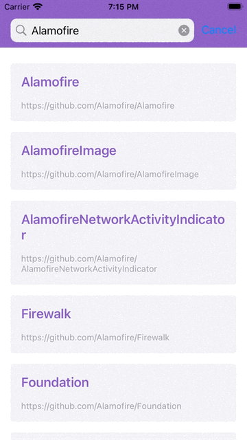

## Arc-MVVM-Study

Github-app  é um aplicativo criado para fins de estudo utilizando a arquitetura MVVM. O app tem como objetivo buscar repositórios  por usuários,
utilizando a API fornecida pelo Github.

 

 
    

        

           <b>Tela de Consulta</b>
             
            
        

         
        

           <b>Tela de Detalhes</b>
             
           
        
 
    

